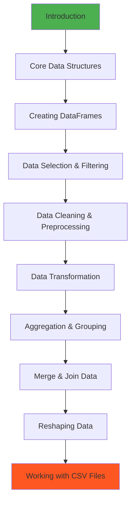

# 🐼 Pandas Data Analysis Mastery

<div align="center">


*A comprehensive guide to data manipulation, cleaning, and analysis using Python's Pandas library*

[Portfolio](https://decodedbyfarhan.tech) • [LinkedIn](https://www.linkedin.com/in/farhan16/)

</div>

---

## 📚 About This Repository

This repository contains a complete learning path for mastering Pandas, the essential Python library for data analysis and manipulation. From basic operations to advanced techniques like merging, grouping, and reshaping data, these notebooks provide hands-on experience with real-world datasets.

---

## 📂 Repository Structure

### 📓 Jupyter Notebooks

| Notebook | Description | Key Concepts |
|----------|-------------|--------------|
| 📖 **Introduction.ipynb** | Getting started with Pandas | Series, DataFrames, basic operations |
| 🔧 **Data_Cleaning_Preprocessing.ipynb** | Clean and prepare messy data | Handling nulls, duplicates, type conversion |
| 🎯 **Data_Selection_Filtering.ipynb** | Select and filter data efficiently | loc, iloc, boolean indexing, queries |
| 🔄 **Data_Transformation.ipynb** | Transform and modify data | Apply, map, replace, binning |
| 📊 **Aggregation_Grouping.ipynb** | Group and aggregate data | groupby, pivot tables, aggregations |
| 🔗 **Merge_Join_Data.ipynb** | Combine multiple datasets | merge, join, concat, append |
| 📐 **Reshaping_Data.ipynb** | Reshape data structures | pivot, melt, stack, unstack |
| 🏗️ **Core_Data_Structures.ipynb** | Deep dive into Series & DataFrames | Indexing, attributes, methods |
| 📊 **Creating_DataFrames.ipynb** | Multiple ways to create DataFrames | From dict, lists, files, databases |
| 💾 **Working_with_CSV.ipynb** | Import and export CSV files | read_csv, to_csv, parameters |
| 📄 **Pandas.pdf** | Complete reference guide | Quick reference documentation |

### 📊 Dataset Files

```
📁 Data Files/
├── 📄 data.json          → JSON dataset for practice
├── 📗 data.xlsx          → Excel workbook with sample data
├── 📗 data2.xlsx         → Additional Excel dataset
├── 📗 p1.xlsx            → Practice dataset 1
├── 📗 p2.xlsx            → Practice dataset 2
├── 📗 updated.xlsx       → Updated dataset for exercises
└── 🗂️ .ipynb_checkpoints → Auto-saved notebook versions
```

---

## 🚀 Getting Started

### Prerequisites

Ensure you have the following installed:

```bash
Python 3.8+
pip or conda package manager
```

### Installation

1. **Clone the repository**
   ```bash
   git clone https://github.com/farhann-16/Pandas-Data-Analysis.git
   cd Pandas-Data-Analysis
   ```

2. **Install required packages**
   ```bash
   pip install pandas numpy jupyter openpyxl xlrd
   ```

3. **Launch Jupyter Notebook**
   ```bash
   jupyter notebook
   ```

4. **Open any notebook and start learning!**

---

## 🎯 Recommended Learning Path



### 📋 Step-by-Step Guide

1. **Foundation** (Weeks 1-2)
   - Start with `Introduction.ipynb`
   - Master `Core_Data_Structures.ipynb`
   - Practice `Creating_DataFrames.ipynb`

2. **Data Manipulation** (Weeks 3-4)
   - Learn selection techniques in `Data_Selection_Filtering.ipynb`
   - Clean data with `Data_Cleaning_Preprocessing.ipynb`
   - Transform data using `Data_Transformation.ipynb`

3. **Advanced Operations** (Weeks 5-6)
   - Group and aggregate in `Aggregation_Grouping.ipynb`
   - Combine datasets with `Merge_Join_Data.ipynb`
   - Reshape data using `Reshaping_Data.ipynb`

4. **Real-World Applications** (Week 7)
   - Master CSV operations in `Working_with_CSV.ipynb`
   - Work with provided Excel datasets
   - Build your own analysis projects

---

## 💡 What You'll Learn

### 🔹 Core Skills

<table>
<tr>
<td width="50%">

**Data Manipulation**
- ✅ Creating Series and DataFrames
- ✅ Indexing and selecting data
- ✅ Filtering with conditions
- ✅ Sorting and ranking
- ✅ Adding/removing columns

</td>
<td width="50%">

**Data Cleaning**
- ✅ Handling missing values
- ✅ Removing duplicates
- ✅ Data type conversion
- ✅ String operations
- ✅ Outlier detection

</td>
</tr>
<tr>
<td width="50%">

**Data Transformation**
- ✅ Apply custom functions
- ✅ Map and replace values
- ✅ Binning and categorization
- ✅ Date/time operations
- ✅ Feature engineering

</td>
<td width="50%">

**Advanced Analysis**
- ✅ GroupBy operations
- ✅ Pivot tables and cross-tabs
- ✅ Merging and joining datasets
- ✅ Reshaping (pivot/melt)
- ✅ Time series analysis

</td>
</tr>
</table>

---

## 📊 Key Features & Highlights

### 🎓 Comprehensive Coverage
- **14+ notebooks** covering beginner to advanced topics
- **Real datasets** included for hands-on practice
- **Progressive difficulty** with clear explanations
- **Code examples** for every concept

### 💻 Interactive Learning
- Run code directly in Jupyter Notebooks
- Modify examples to see results
- Practice with provided datasets
- Build your own analysis projects

### 📚 Reference Materials
- Complete PDF reference guide
- Code snippets and cheat sheets
- Best practices and tips
- Common pitfalls to avoid

---

## 🛠️ Common Pandas Operations

### Quick Reference

```python
# Reading Data
df = pd.read_csv('data.csv')
df = pd.read_excel('data.xlsx')
df = pd.read_json('data.json')

# Data Inspection
df.head()                    # First 5 rows
df.info()                    # Data types and memory
df.describe()                # Statistical summary
df.shape                     # Dimensions

# Selection & Filtering
df['column']                 # Select column
df[['col1', 'col2']]        # Select multiple columns
df.loc[rows, cols]          # Label-based selection
df.iloc[rows, cols]         # Position-based selection
df[df['age'] > 25]          # Filter rows

# Data Cleaning
df.dropna()                  # Remove missing values
df.fillna(value)            # Fill missing values
df.drop_duplicates()        # Remove duplicates
df.astype(dtype)            # Convert data types

# Transformation
df['new_col'] = df['col'] * 2
df.apply(function)          # Apply function
df.groupby('col').mean()    # Group and aggregate
df.merge(df2, on='key')     # Merge datasets
```

---

## 📈 Sample Projects & Use Cases

### Real-World Applications

1. **Sales Analysis** 📊
   - Analyze revenue trends
   - Customer segmentation
   - Product performance

2. **Data Cleaning Pipeline** 🧹
   - Handle missing data
   - Remove duplicates
   - Standardize formats

3. **Customer Analytics** 👥
   - RFM analysis
   - Churn prediction
   - Lifetime value calculation

4. **Time Series Analysis** ⏰
   - Stock price analysis
   - Seasonal trends
   - Forecasting

---

## 🎯 Learning Outcomes

By completing this course, you will be able to:

- ✅ **Read and write** data from various file formats (CSV, Excel, JSON)
- ✅ **Clean and prepare** messy real-world datasets
- ✅ **Filter and select** data efficiently using multiple methods
- ✅ **Transform data** using apply, map, and vectorized operations
- ✅ **Aggregate and group** data to derive insights
- ✅ **Merge and join** multiple datasets seamlessly
- ✅ **Reshape data** between wide and long formats
- ✅ **Perform statistical analysis** and derive meaningful insights
- ✅ **Build data pipelines** for reproducible analysis
- ✅ **Handle large datasets** efficiently

---

## 💻 System Requirements

### Software
- **Python:** 3.8 or higher
- **Pandas:** Latest version (2.0+)
- **Jupyter:** Notebook or JupyterLab
- **Excel:** Microsoft Excel or LibreOffice (for viewing .xlsx files)

### Python Packages
```bash
pandas>=2.0.0
numpy>=1.24.0
openpyxl>=3.1.0
xlrd>=2.0.0
jupyter>=1.0.0
matplotlib>=3.7.0
seaborn>=0.12.0
```

---

## 📚 Additional Resources

### Official Documentation
- [Pandas Official Docs](https://pandas.pydata.org/docs/)
- [Pandas Cheat Sheet](https://pandas.pydata.org/Pandas_Cheat_Sheet.pdf)

### Recommended Reading
- "Python for Data Analysis" by Wes McKinney
- "Pandas Cookbook" by Theodore Petrou

### Online Resources
- [Pandas User Guide](https://pandas.pydata.org/docs/user_guide/index.html)
- [Kaggle Learn - Pandas](https://www.kaggle.com/learn/pandas)

---

## 🤝 Contributing

Contributions are welcome! Here's how you can help:

1. 🍴 **Fork** the repository
2. 🔧 **Create** a feature branch
   ```bash
   git checkout -b feature/AmazingFeature
   ```
3. 💾 **Commit** your changes
   ```bash
   git commit -m 'Add some AmazingFeature'
   ```
4. 📤 **Push** to the branch
   ```bash
   git push origin feature/AmazingFeature
   ```
5. 🔃 **Open** a Pull Request

### Contribution Ideas
- Add new practice notebooks
- Include more datasets
- Improve documentation
- Fix bugs or typos
- Add visualization examples

---

## 🐛 Issues & Support

Found a bug or have a question? 

- 📝 [Open an issue](https://github.com/farhann-16/Pandas-Data-Analysis/issues)
- 💬 Start a discussion
- 📧 Contact me via LinkedIn

---

## 📝 License

This project is licensed under the MIT License - see the [LICENSE](LICENSE) file for details.

---

## 👨‍💻 Author

**Farhan**

<div align="center">

[](https://decodedbyfarhan.tech)
[](https://www.linkedin.com/in/farhan16/)
[](https://github.com/farhann-16)

</div>

---

## 🙏 Acknowledgments

- Thanks to the Pandas development team for this amazing library
- Inspired by real-world data analysis challenges
- Special thanks to the open-source community
- Dataset sources and contributors

---

## 📊 Project Stats

<div align="center">


</div>

---

<div align="center">

### ⭐ If this repository helped you learn Pandas, give it a star!

**Made with ❤️ and 🐼 by Farhan**


</div>

---

<div align="center">

### 🚀 Ready to master Pandas? Start with `Introduction.ipynb`!

</div>
