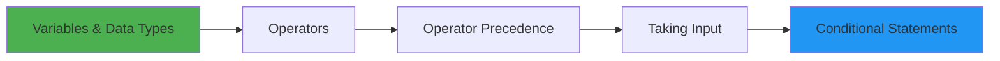
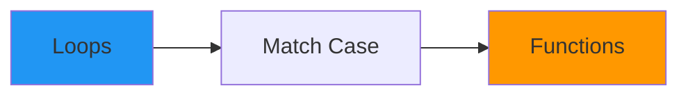
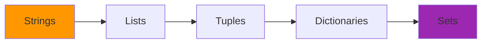
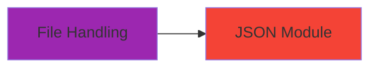

# 🐍 Python Refresher – Complete Programming Guide

<div align="center">


*A comprehensive collection of Python tutorials covering fundamental to advanced concepts — your complete Python reference guide*

[Portfolio](https://decodedbyfarhan.tech) • [LinkedIn](https://www.linkedin.com/in/farhan16/) • [GitHub](https://github.com/farhann-16)

</div>

---

## 📚 About This Repository

This repository serves as a comprehensive Python refresher course, covering essential programming concepts with hands-on examples and exercises. Whether you're brushing up on Python basics or learning advanced concepts, these notebooks provide clear explanations and practical code examples.

**Perfect for:**

* 🎓 Students learning Python
* 💼 Professionals switching to Python
* 🔄 Developers refreshing their skills
* 📖 Reference material for quick lookups

---

## 📂 Repository Structure

### 📓 Jupyter Notebooks Collection

| #  | Notebook                                     | Topics Covered                           | Difficulty      |
| -- | -------------------------------------------- | ---------------------------------------- | --------------- |
| 01 | 📊 **Variables_DataTypes_Typecasting.ipynb** | Variables, data types, type conversion   | ⭐ Beginner      |
| 02 | ➕ **Operators.ipynb**                        | Arithmetic, comparison, logical, bitwise | ⭐ Beginner      |
| 03 | 📐 **Operator_Precedence.ipynb**             | Order of operations, PEMDAS rules        | ⭐ Beginner      |
| 04 | 💬 **Taking_input.ipynb**                    | User input, input validation             | ⭐ Beginner      |
| 05 | 🎯 **Conditional_Statements.ipynb**          | if, elif, else, nested conditions        | ⭐⭐ Intermediate |
| 06 | 🔄 **Loops.ipynb**                           | for, while, nested loops, break/continue | ⭐⭐ Intermediate |
| 07 | 🎭 **Match_Case.ipynb**                      | Pattern matching (Python 3.10+)          | ⭐⭐ Intermediate |
| 08 | ⚙️ **Functions.ipynb**                       | Function definition, parameters, return  | ⭐⭐ Intermediate |
| 09 | 📝 **String_Formatting.ipynb**               | f-strings, format(), string methods      | ⭐⭐ Intermediate |
| 10 | 🔤 **String_StringMethods.ipynb**            | String operations, slicing, methods      | ⭐⭐ Intermediate |
| 11 | 📋 **List_Methods.ipynb**                    | Lists, list comprehensions, methods      | ⭐⭐ Intermediate |
| 12 | 🎯 **Tuples.ipynb**                          | Immutable sequences, tuple operations    | ⭐⭐ Intermediate |
| 13 | 📖 **Dictionary.ipynb**                      | Key-value pairs, dict methods            | ⭐⭐ Intermediate |
| 14 | 🔢 **Set_Methods.ipynb**                     | Sets, set operations, methods            | ⭐⭐ Intermediate |
| 15 | 📁 **File_Handling.ipynb**                   | Reading/writing files, context managers  | ⭐⭐⭐ Advanced    |
| 16 | 📦 **Json_Module.ipynb**                     | JSON parsing, serialization              | ⭐⭐⭐ Advanced    |

---

## 🚀 Getting Started

### Prerequisites

Ensure you have the following installed:

```bash
Python 3.8 or higher
pip (Python package manager)
Jupyter Notebook or JupyterLab
```

### Installation

1. **Clone the repository**

   ```bash
   git clone https://github.com/farhann-16/Python-Refresher.git
   cd Python-Refresher
   ```

2. **Create a virtual environment (recommended)**

   ```bash
   # Windows
   python -m venv venv
   venv\Scripts\activate

   # macOS/Linux
   python3 -m venv venv
   source venv/bin/activate
   ```

3. **Install required packages**

   ```bash
   pip install jupyter notebook
   ```

4. **Launch Jupyter Notebook**

   ```bash
   jupyter notebook
   ```

5. **Open any notebook and start learning!**

---

## 🎯 Recommended Learning Path

### 🌱 Phase 1: Fundamentals (Week 1-2)



**Start Here:**

1. `Variables_DataTypes_Typecasting.ipynb`
2. `Operators.ipynb`
3. `Operator_Precedence.ipynb`
4. `Taking_input.ipynb`
5. `Conditional_Statements.ipynb`

### 🌿 Phase 2: Control Flow & Functions (Week 3-4)



6. `Loops.ipynb`
7. `Match_Case.ipynb`
8. `Functions.ipynb`

### 🌳 Phase 3: Data Structures (Week 5-6)



9. `String_Formatting.ipynb`
10. `String_StringMethods.ipynb`
11. `List_Methods.ipynb`
12. `Tuples.ipynb`
13. `Dictionary.ipynb`
14. `Set_Methods.ipynb`

### 🌲 Phase 4: Advanced Topics (Week 7-8)



15. `File_Handling.ipynb`
16. `Json_Module.ipynb`

---

## 🎓 Best Practices Covered

### Code Quality

* ✅ **PEP 8 Style Guide**
* ✅ **Meaningful Variable Names**
* ✅ **Comments and Docstrings**
* ✅ **DRY Principle**
* ✅ **Error Handling**

### Performance

* ✅ **List Comprehensions**
* ✅ **Generator Expressions**
* ✅ **Built-in Functions**
* ✅ **Efficient String Handling**

### Pythonic Code

* ✅ **Context Managers**
* ✅ **Enumerate and Zip**
* ✅ **f-strings**
* ✅ **Unpacking**

---

## 🤝 Contributing

Contributions are welcome! Help improve this learning resource:

### Ways to Contribute

* 📝 Add more examples
* 🐛 Fix errors or typos
* 💡 Suggest new topics
* 🎨 Improve explanations
* ✅ Add exercises

### How to Contribute

1. Fork the repository
2. Create a feature branch

   ```bash
   git checkout -b feature/NewTopic
   ```
3. Commit your changes

   ```bash
   git commit -m 'Add NewTopic notebook'
   ```
4. Push to the branch

   ```bash
   git push origin feature/NewTopic
   ```
5. Open a Pull Request

---

## 🐛 Issues & Support

* 📝 Open an issue on GitHub
* 💬 Start a discussion
* 📧 Contact via LinkedIn

---

## 📝 License

This project is licensed under the MIT License.

---

## 👨‍💻 Author

**Farhan**

<div align="center">

[](https://decodedbyfarhan.tech)
[](https://www.linkedin.com/in/farhan16/)
[](https://github.com/farhann-16)

</div>

---

<div align="center">

### ⭐ If this repository helped you learn Python, give it a star!

**Made with ❤️ and 🐍 by Farhan**

</div>
